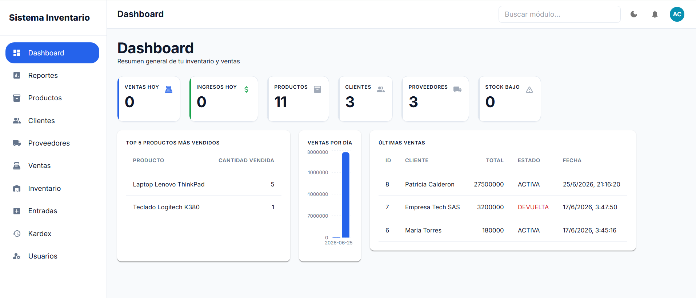
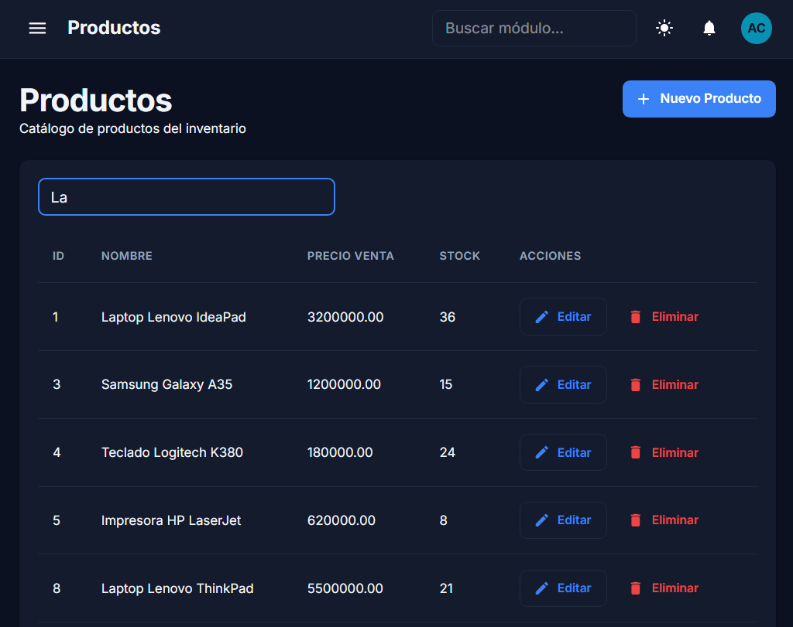
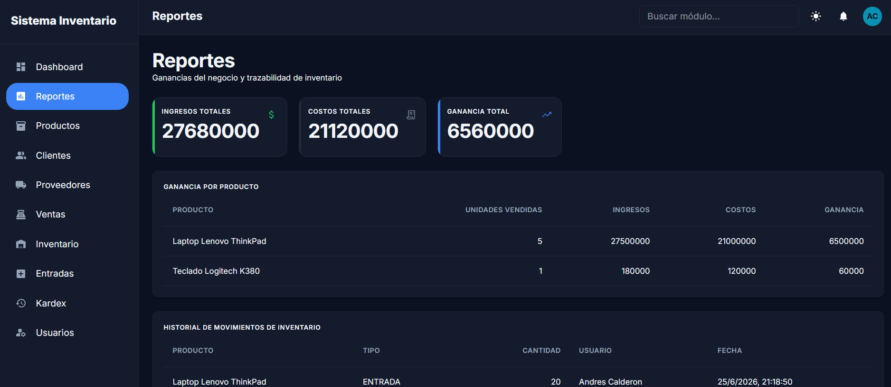

# Sistema de Inventario — FastAPI + React

Sistema fullstack de gestión de inventario con control de acceso por roles, ventas con devoluciones, reportes de ganancias y un dashboard con datos en tiempo real. Backend en **FastAPI + MySQL**, frontend en **React + Material UI**.

> Proyecto personal construido para practicar desarrollo fullstack y prepararme para entrevistas técnicas como desarrollador de software.


---

## Capturas

### Dashboard


### Productos — buscador en vivo y modo oscuro


### Reportes — ganancias y trazabilidad de inventario


---

## Características

**Gestión completa del negocio**
- CRUD de Productos, Clientes, Proveedores y Categorías
- Ventas con cálculo automático de stock y **devoluciones** (que correctamente excluyen el inventario y las ganancias del cálculo)
- Entradas de inventario, historial de movimientos y **Kardex** por producto
- Reporte de **ganancias reales** (ingresos − costos), con desglose por producto

**Control de acceso por roles**
- Autenticación con JWT
- Tres roles (Administrador, Vendedor, Bodeguero) con permisos distintos, aplicados de forma consistente **tanto en el backend** (dependencias de FastAPI en cada endpoint) **como en el frontend** (menú y rutas se adaptan según el rol)

| Módulo | Administrador | Vendedor | Bodeguero |
|---|:---:|:---:|:---:|
| Dashboard / Reportes | ✅ | ✅ | ❌ |
| Productos (ver) | ✅ | ✅ | ✅ |
| Clientes | ✅ | ✅ | ❌ |
| Proveedores | ✅ | ❌ | ✅ |
| Ventas | ✅ | ✅ | ❌ |
| Inventario / Entradas / Kardex | ✅ | ❌ | ✅ |
| Usuarios | ✅ | ❌ | ❌ |

**Dashboard y reportes**
- KPIs en tiempo real (ventas del día, stock bajo, top productos)
- Gráfica de ventas por día
- Historial de movimientos de inventario con trazabilidad (qué, cuándo, quién)

**Interfaz**
- Modo claro / oscuro
- Diseño responsive (sidebar se convierte en menú hamburguesa en mobile)
- Buscador en vivo en las tablas principales

---

## Stack técnico

| | |
|---|---|
| **Backend** | FastAPI, SQLAlchemy, MySQL, JWT (python-jose), bcrypt (passlib) |
| **Frontend** | React 19, Material UI, React Router, Axios, Recharts |
| **Base de datos** | MySQL |

---

## Estructura del proyecto

```
inventario-fullstack/
├── backend/
│   ├── app/
│   │   ├── core/          # Seguridad (JWT, hashing)
│   │   ├── dependencies/  # Auth y control de roles
│   │   ├── models/        # Modelos SQLAlchemy
│   │   ├── routes/        # Endpoints de la API
│   │   ├── schemas/       # Esquemas Pydantic
│   │   ├── database.py
│   │   └── main.py
│   ├── requirements.txt
│   └── .env.example
├── frontend/
│   ├── src/
│   │   ├── components/    # Modales y piezas reutilizables (PageHeader, TableSearchBar...)
│   │   ├── config/        # Navegación (única fuente de verdad para menú/rutas)
│   │   ├── context/       # AuthContext
│   │   ├── pages/          # Una página por módulo
│   │   ├── routes/        # Definición de rutas + guard por rol
│   │   ├── services/      # Llamadas a la API (uno por entidad)
│   │   └── theme/         # Tema claro/oscuro
│   └── package.json
└── database/
    └── schema.sql
```

---

## Instalación

### Requisitos
- Python 3.12+
- Node.js 18+
- MySQL 8+

### 1. Clonar el repositorio

```bash
git clone https://github.com/TU-USUARIO/inventario-fullstack.git
cd inventario-fullstack
```

### 2. Base de datos

Crea la base de datos y corre el script de esquema:

```sql
CREATE DATABASE tienda_inventario_pro;
```

```bash
mysql -u root -p tienda_inventario_pro < database/schema.sql
```

Siembra los 3 roles (el script de esquema crea la tabla pero no los datos):

```sql
INSERT INTO roles (nombre) VALUES ('Administrador'), ('Vendedor'), ('Bodeguero');
```

### 3. Backend

```bash
cd backend
python -m venv venv

# Windows
.\venv\Scripts\activate
# Linux / Mac
source venv/bin/activate

pip install -r requirements.txt
```

Copia `.env.example` a `.env` y completa tus propios valores:

```bash
cp .env.example .env
```

**Crea el primer usuario administrador.** Como crear usuarios requiere ser administrador, el primero hay que insertarlo directo en la base de datos. Genera un hash de contraseña con Python:

```python
# Desde la carpeta backend, con el venv activado:
python -c "from app.core.security import hash_password; print(hash_password('tu_password'))"
```

Y con ese hash, inserta el usuario (rol 1 = Administrador):

```sql
INSERT INTO usuarios (nombre, email, password, rol_id, estado)
VALUES ('Tu Nombre', 'tu_email@ejemplo.com', '<hash_generado_arriba>', 1, 1);
```

Levanta el servidor:

```bash
uvicorn app.main:app --reload
```

La API queda disponible en `http://127.0.0.1:8000` — la documentación interactiva (Swagger) en `http://127.0.0.1:8000/docs`.

### 4. Frontend

```bash
cd frontend
npm install
npm run dev
```

La app queda disponible en `http://localhost:5173`.

---

## Decisiones de diseño que vale la pena explicar

- **Las devoluciones no se eliminan, se marcan.** Una venta devuelta cambia su `estado` a `DEVUELTA` en vez de borrarse, y todos los cálculos de ganancias e ingresos excluyen explícitamente las ventas en ese estado — pero siguen siendo visibles en el historial, porque sí pasaron.
- **Roles aplicados en dos capas.** El frontend oculta módulos según el rol para una buena experiencia de usuario, pero la verdadera autorización vive en el backend (dependencias de FastAPI en cada endpoint) — ocultar un botón no es seguridad real si la API de atrás sigue abierta.
- **El costo de ganancias usa el precio de compra actual del producto**, no un histórico al momento exacto de cada venta. Es una limitación conocida y documentada en el código (ver `reportes_routes.py`); la solución completa requeriría guardar el costo unitario en cada detalle de venta al momento de vender.

## Mejoras futuras

- [ ] Snapshot de costo unitario en cada venta (para reportes de ganancias 100% históricos)
- [ ] Subida real de foto de perfil de usuario
- [ ] Paginación y búsqueda en el backend si el volumen de datos crece significativamente
- [ ] Tests automatizados (actualmente verificado manualmente)

---

## Autor

**Andrés Calderón**
[LinkedIn](#) · [GitHub](#)

---

## Licencia

MIT
